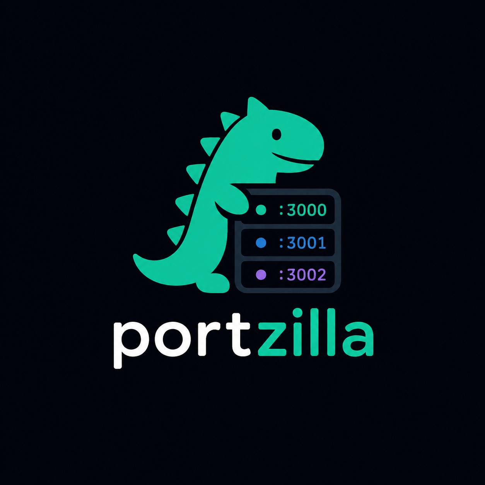
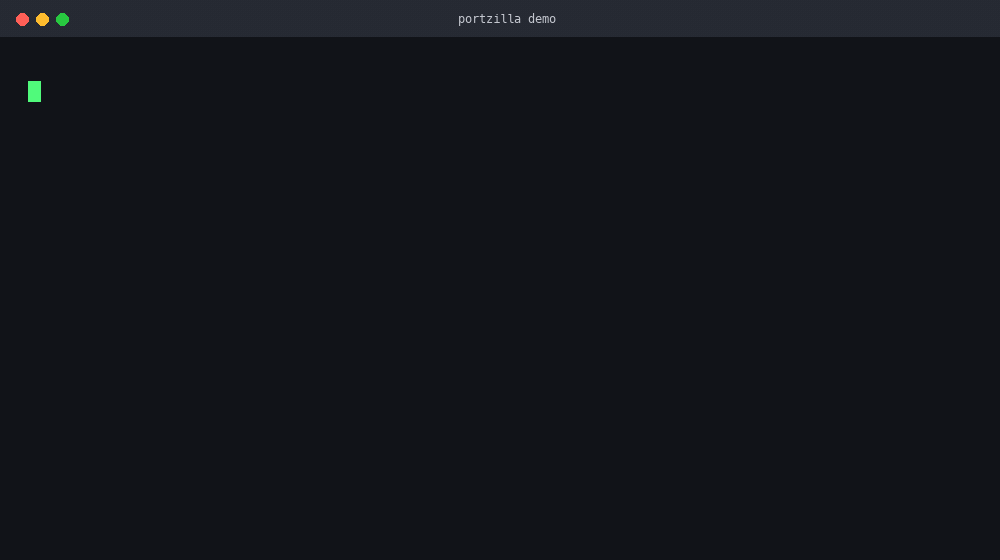

<p align="center">
  
</p>

<h1 align="center">portzilla</h1>

<p align="center">
  <strong>Lease registry for localhost ports — stop killing your sibling's dev server.</strong>
</p>

<p align="center">
  <a href="https://github.com/011010/portzilla/actions/workflows/ci.yml"></a>
  <a href="https://crates.io/crates/portzilla"></a>
  <a href="https://www.npmjs.com/package/portzilla"></a>
  <a href="LICENSE"></a>
</p>

> AI coding agents (Claude Code, Cursor, etc.) run parallel sessions in git worktrees — each starting its own dev server. Today they coordinate by killing whatever is on a port. `portzilla` is the layer that **prevents the conflict**.

- **Claim, don't kill** — `portzilla claim 3000 --tag next-dev` gives you a port with owner PID + purpose tag. Conflicts get the next free port instead of stealing.
- **Ask before you kill** — `portzilla who 3000` tells you who owns a port. JSON everywhere so agents can consume it directly.
- **Guard by default** — intercepts `kill`, `lsof | xargs kill`, `fuser -k`, `kill-port` and blocks kills against another session's live lease.

Existing tools (`witr`, `kill-port`, ServerSlayer) tell you what's on a port *after* the fact. `portzilla` prevents the conflict in the first place.



## Contents

- [Quick start](#quick-start)
- [Demo](#demo)
- [Install](#install)
- [Commands](#commands)
- [MCP server](#mcp-server)
- [Kill guard](#kill-guard)
- [Data file & config](#data-file--config)
- [Limitations](#limitations)

## Quick start

```console
$ portzilla claim 3000 --tag next-dev --session "$CLAUDE_CODE_SESSION_ID"
claimed port 3000 for pid 57107 (tag: next-dev)

$ portzilla who 3000
port: 3000
pid: 57107
tag: next-dev
status: alive

$ portzilla ls
PORT    PID      STATUS AGE        TAG
3000    57107    alive  5s         next-dev
```

All commands accept `--json` for agent consumption. See [CLI reference](docs/CLI.md).

## Demo

```console
$ portzilla claim 3000 --tag next-dev --pid 57107
claimed port 3000 for pid 57107 (tag: next-dev)

$ portzilla claim 3000 --tag vite-dev --pid 57108
port 3000 is busy; claimed port 3001 instead for pid 57108 (tag: vite-dev)

$ portzilla who 3001 --json
{"port":3001,"pid":57108,"tag":"vite-dev","created_at":1785959877,"session":null,"age_secs":3,"alive":true}

$ portzilla release 3001
warning: released port 3001 whose owning pid 57108 is still alive
port: 3001
pid: 57108
tag: vite-dev
status: alive

$ portzilla prune
no dead leases to prune
```

> Output is real — captured with `PORTZILLA_DATA_DIR` pointed at a temp directory with two live processes.

## Install

**Cargo:**
```console
$ cargo install portzilla
# from local checkout:
$ cargo install --path .
```

**curl** (prebuilt binary to `~/.local/bin`, falls back to cargo):
```console
$ curl --proto '=https' --tlsv1.2 -LsSf https://raw.githubusercontent.com/011010/portzilla/main/scripts/install.sh | sh
# specific version / directory:
$ curl --proto '=https' --tlsv1.2 -LsSf https://raw.githubusercontent.com/011010/portzilla/main/scripts/install.sh | PORTZILLA_VERSION=0.1.0 PORTZILLA_INSTALL_DIR=/usr/local/bin sh
```

**npm** (same native binary):
```console
$ npm install -g portzilla
```

Binaries for Linux x86_64/ARM64, macOS Intel/Apple Silicon, Windows x86_64/ARM64 — each with `.sha256` checksums.

## Commands

| Command | What it does |
|---------|--------------|
| `portzilla claim <PORT> --tag <TAG> [--pid <PID>] [--session <S>]` | Claim a port; on conflict with a live lease from another PID, auto-claims next free port |
| `portzilla ls` | List all leases (`PORT PID STATUS AGE TAG`) |
| `portzilla who <PORT>` | Show lease on a port (exit `2` if none) |
| `portzilla release <PORT>` | Remove lease (always wins; warns if PID still alive) |
| `portzilla prune` | Remove all leases whose PID is dead |

Every command is file-locked and supports `--json`. Full flags, conflict semantics, exit codes and JSON shapes → **[docs/CLI.md](docs/CLI.md)**.

## MCP server

For agents with MCP access (Claude Code, etc.) — typed JSON in/out instead of shelling out:

```console
$ claude mcp add portzilla -- portzilla serve --mcp
```

Exposes `claim`, `who`, `ls`, `release`, `prune` as MCP tools with the same JSON shapes as `--json`. See **[docs/CLI.md#mcp-server](docs/CLI.md#mcp-server)**.

## Kill guard

Makes *checking ownership the default* — blocks `kill` commands that would kill another session's live leased process.

Recognizes `kill <pid>`, `pkill`/`killall`, `lsof -ti:<port> | xargs kill`, `fuser -k <port>/tcp`, `kill-port <port>` (including `sudo`, `env` wrappers and `sh -c` payloads). Verdict: **Allow** / **Deny** (live foreign lease) / **Warn** (unresolvable).

| Harness | Hook | Deny reaches model? | Own-lease? |
|---------|------|---------------------|------------|
| **Claude Code** | `PreToolUse` — `portzilla hook claude-code` | Yes (`permissionDecisionReason`) | **Yes** (`$CLAUDE_CODE_SESSION_ID`) |
| **Cursor** | `beforeShellExecution` — `portzilla hook cursor` | Likely (`agent_message`) | No |
| **Gemini CLI** | `BeforeTool` — `portzilla hook gemini` | Yes (Deny), no Warn channel | No |
| **Codex CLI** | `PreToolUse` — `portzilla hook codex` | Yes (Deny + Warn via `additionalContext`) | No |
| **Kimi CLI** | `PreToolUse` — `portzilla hook kimi` | Yes (stderr on exit 2) | No |
| **OpenCode** | Plugin shim — `portzilla init opencode` | Yes (Deny + Warn) | **Yes** (`$PORTZILLA_SESSION`) |
| **Windsurf** | `pre_run_command` — `portzilla hook windsurf` | Yes (stderr) | No |
| **Anything else** | `portzilla guard -- <cmd>` | N/A (exit 2) | **Yes** (`--session` / `$PORTZILLA_SESSION`) |

Setup: `portzilla init <harness>` prints the snippet to add — never writes files for you. Guard fails open by default; `PORTZILLA_FAIL_CLOSED=1` opts into fail-closed.

Full harness setup, `sh -c` unwrapping rules, and fail-open/closed semantics → **[docs/GUARD.md](docs/GUARD.md)**.

## Data file & config

Resolution order: `PORTZILLA_DATA_DIR` → `$XDG_DATA_HOME/portzilla` → `~/.local/share/portzilla`. State at `leases.json` (atomic write + `leases.json.lock`).

`PORTZILLA_DATA_DIR` isolates tests/CI. `tag` max 1024 chars, `session` max 512, hook stdin capped at 1 MiB. See **[docs/CLI.md](docs/CLI.md)**.

## Limitations

**PID reuse.** Liveness is a point-in-time PID-table check (`sysinfo`). If a PID is recycled before `prune`/`release`, a stale lease can appear `alive` (false positive). No daemon watches for exits — `prune` sweeps on demand. A daemon is on the [roadmap](docs/ROADMAP.md). See [PRD non-goals](docs/PRD.md).

`portzilla` does not start/stop servers, enforce firewall/sandbox, or coordinate across machines.

## Roadmap

v0.1: `claim`/`ls`/`who`/`release`/`prune` + JSON + locked state. v0.1.x: MCP server. v0.2: kill guard + harness adapters + `portzilla guard`. Full plan → [`docs/ROADMAP.md`](docs/ROADMAP.md). Release procedure → [`docs/RELEASING.md`](docs/RELEASING.md).

## License

MIT — see [`LICENSE`](LICENSE).
